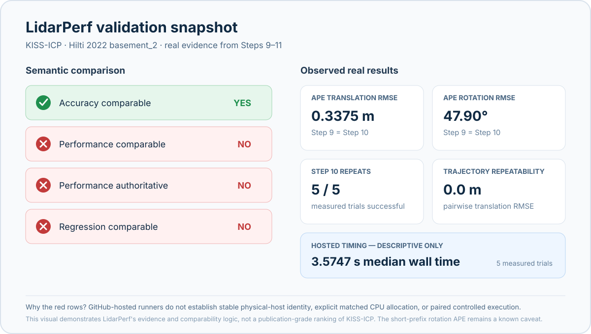

# LidarPerf

**Conformance-aware performance regression testing for LiDAR odometry.**

> **Status:** pre-alpha. The benchmark specification is approved; protocol, synthetic-fixture, result-bundle integrity, host-provenance, controlled process-execution, trajectory-evaluation, real evalio/KISS-ICP integration, complete `.lperf` artifact production, repeated-run/repeatability analysis, semantic result comparison, and the regression decision engine are implemented.

LidarPerf is being built to answer a stricter question than “which odometry method is fastest?”:

> Were the compared results produced under sufficiently equivalent declared conditions, did both estimators remain valid and accurate, and is the observed performance change defensible rather than an artifact of different inputs, preprocessing, timing boundaries, hardware, or run-to-run noise?

The project focuses on:

- versioned benchmark protocols for LiDAR Odometry (LO) and LiDAR-Inertial Odometry (LIO);
- explicit preprocessing, timing-scope, sensor, tuning, and trajectory semantics;
- provenance-rich, checksummed result bundles;
- correctness and accuracy gates before performance claims;
- repeated-run and repeatability analysis;
- semantic comparability checks;
- controlled baseline/candidate regression testing;
- interoperability with existing tools instead of reimplementing estimator and dataset ecosystems.

## Current state

The normative design is in [`SPEC.md`](SPEC.md). The longer research and execution log is maintained in [`LidarPerf_research_execution_plan.md`](LidarPerf_research_execution_plan.md).

The package currently includes:

- strict protocol validation;
- canonical protocol fingerprints;
- reference LO/LIO protocol documents;
- a deterministic synthetic LiDAR conformance fixture with exact `T_W_B` ground truth;
- optional deterministic point noise and rolling-scan motion distortion;
- bitwise fixture golden tests across the supported Python CI matrix;
- versioned `.lperf` result metadata, immutable bundle writing, SHA-256 payload checksums, and verification;
- read-only host fingerprinting and `lidarperf doctor` benchmark-readiness diagnostics;
- a Linux BenchExec/`runexec` backend for process-tree wall time, CPU time, memory, CPU-core/NUMA constraints, resource-limit termination semantics, and an active controlled-readiness probe;
- canonical trajectory parsing/validation, explicit timestamp association, rigid SE(3) alignment, APE, distance-window relative-pose errors, and coverage accounting;
- a thin evalio execution adapter, validated with real KISS-ICP 1.3.0 on the public Hilti 2022 `basement_2` sequence;
- a single-trial orchestration path that connects evalio execution, BenchExec accounting, LidarPerf trajectory evaluation, provenance capture, immutable bundle writing, and independent bundle verification;
- a repeated-run orchestration path with explicit warmups, retained failed trials, per-metric/resource distributions, and all-pairs estimator-output repeatability recomputed by the verifier from immutable trajectory payloads.
- a semantic comparator that independently verifies both bundles, evaluates accuracy/performance/regression comparability separately, enumerates evidence differences, and refuses strict performance ranking when required semantics are missing or incompatible.
- an accuracy-gated regression engine with explicit policy thresholds, paired blocked-run metadata checks, deterministic bootstrap uncertainty, and `PASS` / `FAIL_ACCURACY` / `FAIL_PERFORMANCE` / `FAIL_VALIDITY` / `INCONCLUSIVE` / `NOT_COMPARABLE` verdicts.

Step 8 established the real estimator/data integration path. Step 9 now proves the first complete artifact path: evalio 0.6.1 → KISS-ICP 1.3.0 → 120 Hilti LiDAR scans → BenchExec `runexec 3.35` → LidarPerf trajectory/accuracy evaluation → checksummed `.lperf` bundle → `lidarperf verify: VALID`. The durable bundle is in `docs/validation/step9_kiss_hilti.lperf/`.

The committed Step 9 result is intentionally `exploratory`: it contains one measured trial. Step 10 adds explicit warmups and repeated measured trials, scalar runtime/resource distributions, estimator-output repeatability, and verifier-side aggregate recomputation. The durable Step 10 integration bundle is `docs/validation/step10_kiss_hilti_repeated.lperf/`: one warmup plus five measured KISS-ICP/Hilti executions, all successful and independently verified.

The Step 10 hosted bundle remains `exploratory` even with five measured trials. The specification requires a stable self-hosted or otherwise controlled Linux machine, explicit CPU allocation/thread policy, recorded governor state, controlled storage, and no swap pressure before a result may claim `controlled` strength. Ordinary GitHub-hosted runners therefore validate the repeated-run machinery but are not authoritative performance baselines.

Step 11 implements `lidarperf compare`. Comparability is dimension-aware: accuracy can be comparable even when performance is not. The durable Step 11 report compares the real Step 9 and Step 10 bundles and finds accuracy semantics compatible, while strict performance/regression comparison is rejected because the hosted evidence lacks controlled physical-host identity, explicit CPU allocation/paired execution, and authoritative performance status. The comparator still reports raw metric/resource deltas, but does not rank them.

Step 12 implements `lidarperf regress`. Regression decisions reuse Step 11 comparability
rather than bypassing it, require recorded paired blocked-randomization metadata for strict
performance regression, apply explicit accuracy gates before speed, and require an explicit
practical performance threshold. Paired runtime effects are summarized by median normalized
change with a deterministic bootstrap confidence interval. If evidence is incomparable, a
gate is missing, or uncertainty crosses the threshold, LidarPerf refuses a binary performance
claim. The example policy in `docs/examples/regression_policy.example.yaml` is illustrative
only; its 5% performance and 2% accuracy limits are not package defaults.

## Validation snapshot

The current real-evidence path uses KISS-ICP on the Hilti 2022 `basement_2` sequence. The visual below summarizes the committed Step 9–11 artifacts rather than presenting a publication-grade estimator ranking.



The important result is not that two bars happen to match: LidarPerf can prove that the **accuracy evidence is comparable** while simultaneously refusing a strict **performance/regression** claim from ordinary GitHub-hosted runners. The displayed 3.5747 s median wall time is therefore descriptive integration evidence only. The short-prefix rotation APE remains an explicit scientific caveat.

## Planned CLI

The final interface is expected to grow toward:

```bash
lidarperf doctor
lidarperf run ...
lidarperf verify result.lperf
lidarperf compare baseline.lperf candidate.lperf
lidarperf regress baseline.lperf candidate.lperf --policy policy.yaml
```

Available now:

```bash
lidarperf --version
lidarperf doctor
lidarperf doctor --json
lidarperf doctor --data-path /path/to/dataset
lidarperf protocol validate protocols/lo/se3_v1.yaml
lidarperf protocol validate protocols/lio/se3_v1.yaml
lidarperf synthetic generate ./synthetic-fixture --poses 240
lidarperf verify ./result.lperf
lidarperf compare baseline.lperf candidate.lperf
lidarperf regress baseline.lperf candidate.lperf --policy docs/examples/regression_policy.example.yaml
```

`doctor` performs a read-only host probe and reports benchmark-relevant operating-system, CPU/topology, affinity, governor, memory/swap, cgroup, storage, NVIDIA/CUDA, system-load, power, and BenchExec capability metadata. It does not silently tune or modify the machine. `--json` emits the complete versioned `lidarperf.doctor.v1` report. Passing `--data-path` also classifies the dataset filesystem and warns about network storage.

The host fingerprint intentionally excludes usernames, hostnames, MAC addresses, serial numbers, GPU UUIDs, and other unnecessary machine identifiers. Dynamic conditions such as current load, swap use, governor, and CPU affinity are recorded in the snapshot but excluded from the stable `host_sha256` identity.

`protocol validate` parses YAML/JSON with the v0.1 Pydantic schema, rejects unknown or contradictory fields, and prints the canonical SHA-256 protocol fingerprint.

`synthetic generate` creates a tiny project-owned LiDAR sequence for conformance and CI testing. The generated fixture contains exact `T_W_B` TUM ground truth, per-scan point files, a timestamped scan index, and an explicit manifest. It is deliberately **not** a real-world ranking dataset.

`verify` validates a `.lperf` directory's versioned metadata, protocol/config provenance links, declared file inventory, execution-log layout, SHA-256 payload checksums, trial-count consistency, and the minimum trial count required by the declared measurement class. It returns `VALID`, `VALID WITH WARNINGS`, or `INVALID`.

`compare` verifies both bundles first and emits a versioned `lidarperf.comparison.v1` report. It checks accuracy, performance, and regression comparability separately against the v0.1 specification; reports all failed checks and observed evidence differences; summarizes common accuracy/resource scalar changes; and never converts incomparable evidence into a strict performance ranking. Intentional configuration, build-environment, or dependency changes can be declared explicitly with repeated `--declare-change` options rather than being silently ignored. `--json` emits the complete machine-readable report.

`regress` builds on the verified Step 11 comparison and emits `lidarperf.regression.v1`.
Strict regression requires comparable controlled evidence plus paired execution metadata
(`pairing_id`, randomization seed, and one `AB`/`BA` order record per pair). Accuracy gates
run before the performance gate. The performance decision uses paired normalized changes, a
median effect estimate, a bootstrap confidence interval, and an explicit practical threshold
from a policy file. Missing gates or a confidence interval that straddles the threshold
produce `INCONCLUSIVE`; incompatible evidence produces `NOT_COMPARABLE`. LidarPerf does not
silently invent a universal performance or accuracy threshold.

### evalio backend

Install the optional evalio integration with:

```bash
python -m pip install -e '.[evalio]'
```

The adapter delegates dataset loading and estimator execution to evalio while keeping
LidarPerf authoritative for protocol-scoped trajectory validation and metrics. Step 8
validated `hilti_2022/basement_2` with KISS-ICP for a 120-scan prefix. The input interval
starts about 100 ms before Hilti ground truth, so LidarPerf records input support,
reference support, and their evaluable intersection separately rather than silently
penalizing the prefix or inventing unavailable ground truth.

The Step 8 JSON remains a functional-integration record. Step 9 reuses the same real path inside the complete bundle pipeline and preserves the raw evalio estimate/ground-truth CSVs as checksummed bundle artifacts. Neither result is a publication-quality KISS accuracy claim; the short-prefix rotation APE remains an explicit scientific caveat.

### BenchExec backend

Authoritative v0.1 process-level measurement uses BenchExec's `runexec` integration surface instead of a custom process monitor. Install the optional dependency with:

```bash
python -m pip install -e '.[benchmark]'
```

The `benchmark` extra intentionally installs the portable BenchExec Python package only. On cgroups-v2 hosts where BenchExec needs to create its own delegated scope, use the distribution's recommended BenchExec package or install the optional systemd integration with the required `libsystemd` development files available. Running BenchExec inside an already delegated `systemd-run --user --scope ... -p Delegate=yes` scope is another supported host setup.

The backend executes argument vectors directly without a shell and can delegate CPU-time, wall-time, memory, CPU-core, and NUMA-node limits to `runexec`. It normalizes `walltime`, `cputime`, peak memory, child return/signal information, and BenchExec termination reasons into versioned LidarPerf execution records.

`BenchExecBackend.probe_capability()` performs an actual tiny `runexec` execution instead of treating “binary exists” as proof of benchmark readiness. A host is controlled-ready only if process-tree timing and memory accounting succeed. Ordinary GitHub-hosted jobs do not start with the cgroup delegation BenchExec needs; the Step 9 validation workflow proved that a deliberately delegated transient systemd scope can supply working accounting there. Hosted-runner measurements are still marked non-authoritative because accounting capability does not make ephemeral cloud hardware a stable performance baseline.

BenchExec writes command stdout and stderr into one output file; LidarPerf therefore names this artifact a **combined output log** at the backend layer rather than pretending the streams were measured separately. Result bundles accept either one `process.log` or a genuine `stdout.log` + `stderr.log` pair, never both. The backend disables BenchExec namespace/container mode by default so estimator output paths retain ordinary host filesystem semantics; software containerization remains a separate planned Docker backend.

For example, to exercise point-time semantics and deskew-related tests:

```bash
lidarperf synthetic generate ./distorted-fixture \
  --poses 50 \
  --max-points 256 \
  --noise-std 0.005 \
  --motion-distortion
```

### Built-in protocol identities

The current reference documents resolve to:

```text
lidarperf/lo-se3@1   12d51a84c47c9ff75f0feb828ba24a8210c87ecac8e595d09485dec72719ba41
lidarperf/lio-se3@1  440847ba6e087fe178e5273d2788e6531de679092920f737045462610f6cd735
```

These hashes identify the fully resolved protocol content. A semantic protocol change must produce a different content hash and, once a protocol is released, a new protocol version rather than silently changing the old definition.

## Development

Python 3.11+ is required.

```bash
python -m pip install -e '.[dev]'
pytest
ruff check .
```

## Scope

Official v0.1 protocol work is limited to:

- LiDAR-only odometry (LO)
- LiDAR-inertial odometry (LIO)
- CPU-oriented controlled process benchmarking

SLAM loop closure, pairwise registration, authoritative GPU benchmarking, energy benchmarking, camera/radar odometry, and a hosted benchmark service are intentionally deferred.

## License

Apache-2.0. Third-party estimators, datasets, and integrations retain their own licenses.

## AI-assisted development

AI tools are used substantially in implementation, research assistance, documentation, and test generation. Human responsibility, validation, design authority, and disclosure policy are documented in [`AI_USAGE.md`](AI_USAGE.md).
